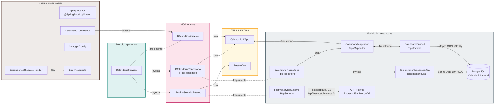

# Diagrama de arquitectura — API Calendario

Arquitectura cebolla (onion) de la API Calendario (Spring Boot + PostgreSQL).

```mermaid
graph LR
    %% Módulo Presentación
    subgraph Presentacion [Módulo: presentacion]
        ApiApp["ApiApplication<br/>@SpringBootApplication"]
        Controladores[CalendarioControlador]
        Configuracion[SwaggerConfig]
        Handlers[ExcepcionesGlobalesHandler]
        DtosPresentacion[ErrorRespuesta]
    end

    %% Módulo Aplicación
    subgraph Aplicacion [Módulo: aplicacion]
        ServiciosApp[CalendarioServicio]
    end

    %% Módulo Core
    subgraph Core [Módulo: core]
        InterfacesServicio[ICalendarioServicio]
        InterfacesRepo[ICalendarioRepositorio<br/>ITipoRepositorio]
        InterfacesIntegracion[IFestivoServicioExterno]
    end

    %% Módulo Dominio
    subgraph Dominio [Módulo: dominio]
        Entidades[Calendario / Tipo]
        DTOs[FestivoDto]
    end

    %% Módulo Infraestructura
    subgraph Infraestructura [Módulo: infraestructura]
        RepositoriosImpl[CalendarioRepositorio<br/>TipoRepositorio]
        Mapeadores[CalendarioMapeador<br/>TipoMapeador]
        IntegracionExt[FestivoServicioExterno<br/>HttpServicio]
        RepositoriosJPA[ICalendarioRepositorioJpa<br/>ITipoRepositorioJpa]
        EntidadesJPA[CalendarioEntidad<br/>TipoEntidad]
        DB[(PostgreSQL<br/>CalendarioLaboral)]
        APIExterna[API Festivos<br/>Express JS + MongoDB]
    end

    %% Presentación -> Core / Dominio
    Controladores -->|Inyecta| InterfacesServicio
    Handlers -->|Usa| DtosPresentacion

    %% Enlaces invisibles: ordenan las capas de izquierda a derecha
    DtosPresentacion ~~~ ServiciosApp
    Entidades ~~~ RepositoriosImpl
    DTOs ~~~ IntegracionExt

    %% Aplicación -> Core / Dominio
    ServiciosApp -.->|Implementa| InterfacesServicio
    ServiciosApp -->|Inyecta| InterfacesRepo
    ServiciosApp -->|Inyecta| InterfacesIntegracion

    %% Core -> Dominio
    InterfacesServicio -->|Usa| Entidades
    InterfacesRepo -->|Usa| Entidades
    InterfacesIntegracion -->|Usa| DTOs

    %% Infraestructura -> Core / Dominio
    InterfacesRepo <-.-|Implementa| RepositoriosImpl
    InterfacesIntegracion <-.-|Implementa| IntegracionExt
    Entidades <-->|Transforma| Mapeadores

    %% Infraestructura interna
    RepositoriosImpl -->|Usa| Mapeadores
    RepositoriosImpl -->|Inyecta| RepositoriosJPA
    Mapeadores <-->|Transforma| EntidadesJPA
    RepositoriosJPA -->|Spring Data JPA / SQL| DB
    EntidadesJPA -->|Mapeo ORM @Entity| DB
    IntegracionExt -->|RestTemplate / GET<br/>/api/festivos/obtener/año| APIExterna

    %% Estilos de Módulos
    style Presentacion fill:#efebe9,stroke:#5d4037,stroke-width:2px
    style Aplicacion fill:#e0f2f1,stroke:#00796b,stroke-width:2px
    style Core fill:#fce4ec,stroke:#c2185b,stroke-width:2px
    style Dominio fill:#fff8e1,stroke:#f9a825,stroke-width:2px
    style Infraestructura fill:#eceff1,stroke:#455a64,stroke-width:2px
```
