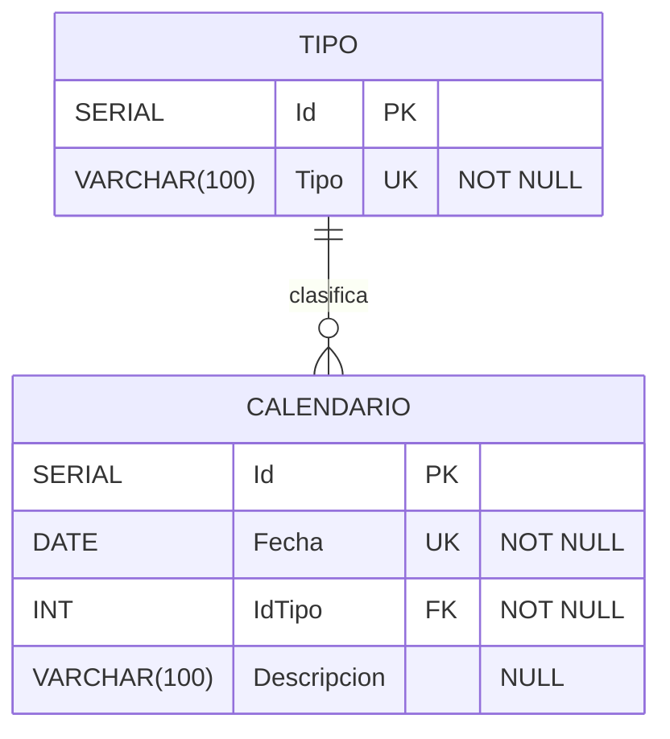

# Diagrama relacional — Base de datos CalendarioLaboral (PostgreSQL)

Cada día del calendario pertenece a un tipo: día laboral, fin de semana o día festivo.

```mermaid
erDiagram
    TIPO ||--o{ CALENDARIO : clasifica

    TIPO {
        SERIAL Id PK
        VARCHAR(100) Tipo UK "NOT NULL"
    }

    CALENDARIO {
        SERIAL Id PK
        DATE Fecha UK "NOT NULL"
        INT IdTipo FK "NOT NULL"
        VARCHAR(100) Descripcion "NULL"
    }
```
